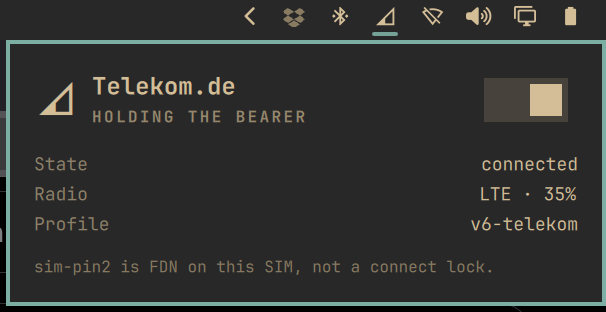

# WWAN connection widget

Bar widget for cellular / mobile data on Omarchy 4 (Quattro). It shows signal and operator, and connects or disconnects the NetworkManager gsm profile with one switch.

The widget hides when the machine has no modem. Wi-Fi and Ethernet stay in the stock network widget.



Plugin id: `io.github.serg3k.omarchy-plugin-wwan`. Listed on [Omarchy Plugins](https://omarchyplugins.com/plugin.html?id=io.github.serg3k.omarchy-plugin-wwan).

## Features

- Hides when no modem is present
- One switch for mobile data: unblock the WWAN radio if needed, enable the modem, bring the gsm profile up
- Bar icon tracks the NetworkManager profile, not leftover ModemManager state
- Panel shows operator, access technology, signal, profile, and a short state line
- Stays visible when Wi-Fi or Ethernet owns the default route

## Requirements

- Omarchy **4.0.0 Quattro** or later (Quickshell bar, not Waybar)
- `ModemManager` and `NetworkManager`
- A gsm / WWAN modem that already works with `mmcli` and an NM gsm profile (APN saved in NetworkManager)

This plugin does not ship an APN editor. Save the gsm profile with `nmtui` first. If the modem stays in enabling or low power, see [FCC unlock](#fcc-unlock).

## FCC unlock

Many US-sold Lenovo, Dell, and HP modules stay in enabling or low power until you enable an FCC unlock script. That is host setup. This plugin does not ship unlock scripts.

1. Find the modem `vid:pid` in `lsusb` or `lspci -nn`. Match it to a name under `/usr/share/ModemManager/fcc-unlock.available.d/`.
2. As root, link **only** that script and restart ModemManager:

```bash
mkdir -p /etc/ModemManager/fcc-unlock.d
ln -sft /etc/ModemManager/fcc-unlock.d /usr/share/ModemManager/fcc-unlock.available.d/vid:pid
systemctl restart ModemManager
```

On this ThinkPad the Quectel EM061K-GL id is `2c7c:6008`.

Do not symlink every file in `fcc-unlock.available.d`. Some vendors ship their own unlock package instead of the ModemManager script.

See [Arch Wiki: FCC locking](https://wiki.archlinux.org/title/Mobile_broadband_modem#FCC_locking) and [ModemManager: FCC unlock](https://modemmanager.org/docs/modemmanager/fcc-unlock/).

## Install

This repo is a plugin: `manifest.json` at the root.

```bash
omarchy plugin add https://github.com/serg3k/omarchy-plugin-wwan.git --enable
```

From a local checkout:

```bash
mkdir -p ~/.config/omarchy/plugins
ln -sfn "$(pwd)" ~/.config/omarchy/plugins/io.github.serg3k.omarchy-plugin-wwan
omarchy plugin validate ~/.config/omarchy/plugins/io.github.serg3k.omarchy-plugin-wwan
omarchy plugin enable io.github.serg3k.omarchy-plugin-wwan
```

If the icon does not appear, run `omarchy-shell shell rescanPlugins` or `omarchy restart shell`. Move it with `omarchy bar move io.github.serg3k.omarchy-plugin-wwan --section right` if you want a different slot.

## Removal

```bash
omarchy plugin remove io.github.serg3k.omarchy-plugin-wwan
```

That disables the widget and removes the checkout or symlink under `~/.config/omarchy/plugins/`. A hand-made folder with no git remote is moved to a timestamped backup instead of being deleted.

## Use

- **Click** the bar icon to open the panel.
- **Switch** turns mobile data on or off. On: unblock the WWAN radio if needed, enable the modem, bring the gsm profile up. Off: take the profile and bearer down; the radio stays on so the next connect is fast.
- **Right-click** the bar icon toggles the same switch. **Middle-click** refreshes status.
- There is **one** switch. rfkill, airplane mode, and ThinkPad FN are not a second control. If the radio is blocked, the same switch turns it back on as part of mobile data on.
- The bar still shows the modem when Wi-Fi owns the default route.

### Keyboard

Inside the panel:

- `t`: toggle mobile data
- `r`: refresh status
- arrows / `j` `k`: move the cursor
- enter / space: activate
- `esc`: close

### Icons

| What you did | Bar glyph |
|---|---|
| Mobile data connected | Signal wedge (more fill = stronger) |
| Profile down, radio still on | Empty wedge, dim |
| Radio off (rfkill / disabled) | Slashed signal wedge |

`sim-pin2` on a working modem is FDN, not a lock. A real PIN/PUK lock blocks the switch.

## Hardware tested

| Date | Machine | Modem | Notes |
|---|---|---|---|
| 2026-08-18 | Lenovo ThinkPad T14 Gen 6 (`21QJ00DTGE`), Omarchy 4.0.0, kernel `6.18.2-arch2-1` | Quectel **EM061K-GL** (LTE) | NM profile `v6-telekom`, operator Telekom.de, FCC unlock `2c7c:6008` already on the host |

Other laptops with a ModemManager gsm device should work the same. They are not tested in this tree.

## License

MIT. See [LICENSE](LICENSE).
